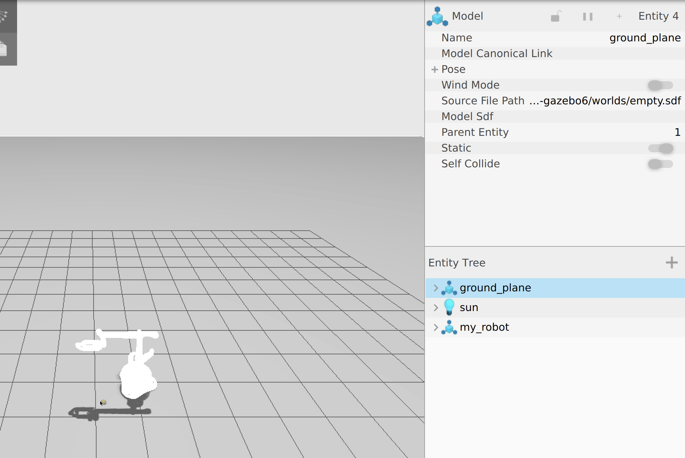
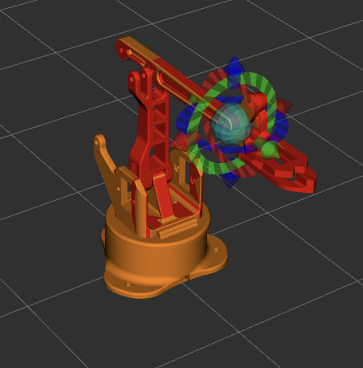
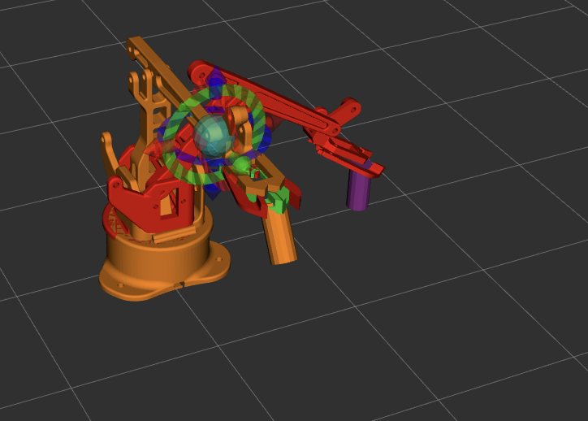

# Manipulator3R-RRR

A full **ROS 2-based 3R manipulator robot** project for **simulation, motion planning, and pick-and-place tasks**, entirely containerized using **Docker Compose**.

This repository demonstrates a complete robotics workflow — from URDF description and ROS2 control to MoveIt2 pick-and-place, custom nodes, and simulation — all modular and reproducible.

---

## 🧭 Table of Contents

1. [Project Overview](#1️⃣-project-overview)  
2. [Requirements](#2️⃣-requirements)  
3. [Docker Setup](#3️⃣-docker-setup)  
4. [Running the Simulation](#4️⃣-running-the-simulation)  
5. [MoveIt2 Control, Pick-and-Place & Functionalities](#5️⃣-moveit2-control-pick-and-place--functionalities)

---

## 1️⃣ Project Overview

The **Manipulator3R-RRR** project is a modular ROS 2 workspace that includes:

| Package | Purpose |
|----------|----------|
| 🛠️ **robot_controller_pkg** | Implements **ros2_control** for controlling the 3R manipulator joints. |
| 🤖 **robot_moveit** | Provides **MoveIt2** integration for motion planning and **pick-and-place tasks** using the MTC plugin. |
| 📦 **robot_msgs** | Contains **custom ROS 2 messages** for communication between nodes. |
| 🎮 **robot_simulation_pkg** | Contains the **URDF/Xacro description** of the 3R manipulator for Gazebo simulation. |
| 🧰 **robot_utils** | Custom utility scripts for robot control, transforms, and helpers. |
| ⚙️ **tuto_cmake_pkg** | Example nodes written in **C++** for learning and testing. |
| 🐍 **tuto_pkg** | Example nodes written in **Python** for learning and testing. |

All packages are containerized using Docker Compose for reproducible development.

---

## 2️⃣ Requirements

- **Docker** ≥ 24.x  
- **Docker Compose** ≥ 1.29  

Without Docker container, you need:

- **ROS 2 Humble**  
- **Ubuntu 22.04** (recommended)  
- **X11 display support** for GUI tools (RViz, Gazebo)  
- **Gazebo Fortress**  

---

## 3️⃣ Docker Setup

### 🐳 docker-compose.yml

Make sure to adjust the volume path to your local workspace:

```yaml
version: "3.9"
services:
  ros-humble-tuto-1:
    build:
      context: .
      dockerfile: Dockerfile-Humble
    command: /bin/bash
    environment:
      - DISPLAY=$DISPLAY
      - QT_X11_NO_MITSHM=1
    image: ros2-humble-tuto-image:1.0
    container_name: ros2-humble-tuto-container
    restart: unless-stopped
    volumes:
      - ws-volume:/root/ros_ws
      - /tmp/.X11-unix:/tmp/.X11-unix
    ports:
      - "11312:11312"
    tty: true
    stdin_open: true
    
networks:
  ros_tuto_macvlan:
    driver: bridge
    driver_opts:
      parent: enp0s1
    ipam:
      config:
        - subnet: 192.168.1.0/24
          gateway: 192.168.1.1

volumes:
  ws-volume:
    driver: local
    driver_opts:
      type: none
      device: /home/andi/DockerDev/manipulator_3R/ros_ws
      o: bind
```

### ⚙️ Setup Commands
1️⃣ Build the Docker image:

```bash
docker-compose build
```

2️⃣ Start the container:

```bash
xhost +local:root   # Allow GUI for Gazebo/RViz
docker-compose up -d
```
3️⃣ Access the running container:

```bash
docker exec -it ros2-humble-tuto-container bash
```
4️⃣ Build and source your ROS 2 workspace:

```bash
cd ~/ros_ws
colcon build
source install/setup.bash
```
Your environment is now ready to launch simulation, MoveIt2 control, and tutorial nodes.

---

## 4️⃣ Running the Simulation
🎮 4.1 Launch Gazebo Simulation
Visualize the 3R manipulator in a simulated Gazebo world:

```bash
ros2 launch robot_simulation_pkg gazebo.launch.py
```
Example: Manipulator in Gazebo simulation.


## 🛠️ 4.2 Run Controllers
Load the ros2_control controllers for the manipulator:

```bash
ros2 launch robot_controller_pkg controller.launch.py
```

Verify available controllers:

```bash
ros2 control list_controllers
```
---

## 5️⃣ MoveIt2 Control, Pick-and-Place & Functionalities
### 🤖 5.1 Launch MoveIt2
```bash
ros2 launch robot_moveit moveit.launch.py
```
This provides:

- RViz2 motion planning interface
- Collision checking and trajectory execution

Example: Manipulator in RViz2.


### 📦 5.2 Pick-and-Place Task
Implements a Pick-and-Place task for the manipulator using the MoveIt Task Constructor (MTC) plugin.

Steps:

1️⃣ Launch the manipulator RViz visualization with fake controllers:

```bash
ros2 launch robot_moveit moveit_fake.launch.py
```
2️⃣ Launch the node creating the pick-and-place task:

```bash
ros2 launch robot_moveit mtc_node
```
Example: Pick-and-place task in RViz:


### 🎮 5.3 Gazebo Simulation with MoveIt2
Run the Gazebo simulation with ros2_control controllers and MoveIt2 to generate trajectories and execute them.

Steps:

0️⃣ Change the xacro parameter use_fake_control to false in robot_ros2_control.xacro
1️⃣ Launch Gazebo:

```bash
ros2 launch robot_simulation_pkg gazebo.launch.py
```
2️⃣ Launch controllers:

```bash
ros2 launch robot_controller_pkg controller.launch.py
```
3️⃣ Launch MoveIt2:

```bash
ros2 launch robot_moveit moveit.launch.py
```
### 🐍 5.4 Run Tutorial Nodes
Run example nodes for testing and learning:

C++ tutorial nodes:

```bash
ros2 run tuto_cmake_pkg example_cpp_node
```
Python tutorial nodes:

```bash
ros2 run tuto_pkg example_python_node
```